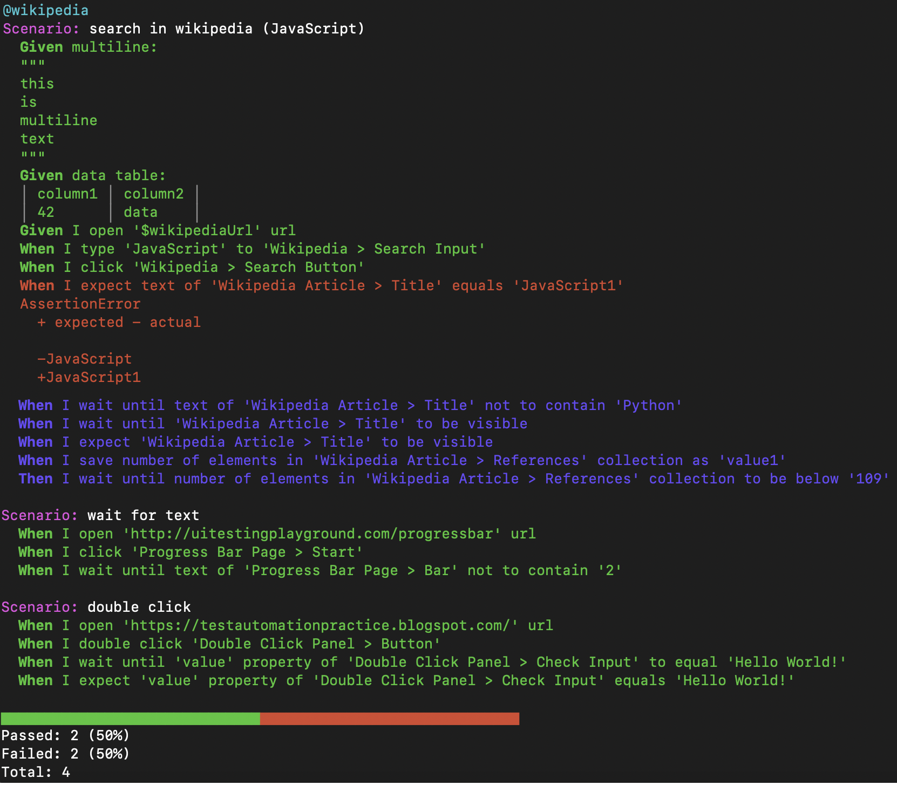

# @qavajs/console-formatter

This is console formatter for cucumber framework

### Installation
To install formatter run

`npm install @qavajs/console-formatter`

and add to formatter section in config file

```javascript
module.exports = {
    default: {
        format: ['@qavajs/console-formatter']
    }
}
```

or pass `--format @qavajs/console-formatter in cli`
             



