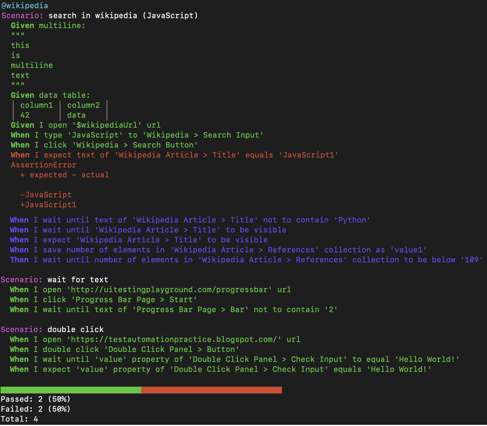

# @qavajs/console-formatter

Console formatter for @qavajs and cucumberjs frameworks

### Installation
```
npm install @qavajs/console-formatter
```

add `@qavajs/console-formatter` to `format` property and configure in `formatOptions` property

```typescript
export default {
    format: ['@qavajs/console-formatter'],
    formatOptions: {
        console: {
            showLogs: true, // show this.log entries in output. Default - false
            showProgress: false // show progress bar. Default - false 
        }
    }
}
```

or pass `--format @qavajs/console-formatter in cli`
             



